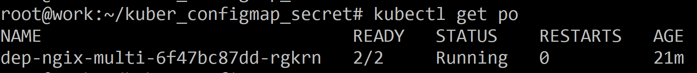
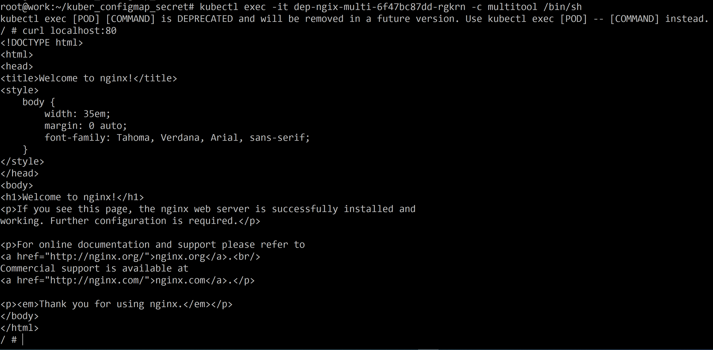
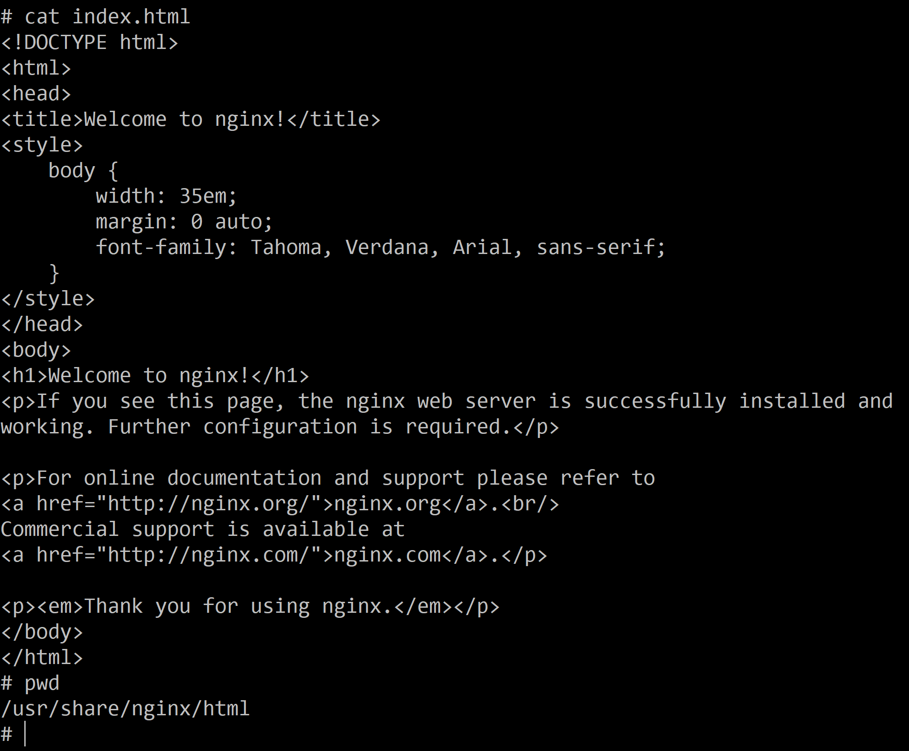
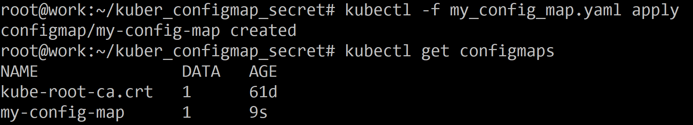
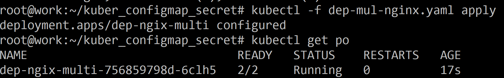
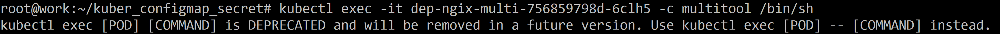
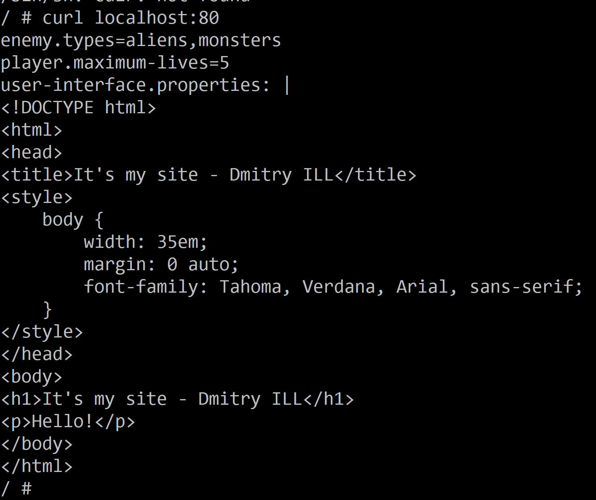

# Домашнее задание к занятию «Конфигурация приложений» - Илларионов Дмитрий

### Цель задания

В тестовой среде Kubernetes необходимо создать конфигурацию и продемонстрировать работу приложения.

------

### Чеклист готовности к домашнему заданию

1. Установленное K8s-решение (например, MicroK8s).
2. Установленный локальный kubectl.
3. Редактор YAML-файлов с подключённым GitHub-репозиторием.

------

### Инструменты и дополнительные материалы, которые пригодятся для выполнения задания

1. [Описание](https://kubernetes.io/docs/concepts/configuration/secret/) Secret.
2. [Описание](https://kubernetes.io/docs/concepts/configuration/configmap/) ConfigMap.
3. [Описание](https://github.com/wbitt/Network-MultiTool) Multitool.

------

### Задание 1. Создать Deployment приложения и решить возникшую проблему с помощью ConfigMap. Добавить веб-страницу

1. Создать Deployment приложения, состоящего из контейнеров nginx и multitool.

Создал по аналогии как уже раньше сохдавал:

```
apiVersion: apps/v1
kind: Deployment
metadata:
  name: dep-ngix-multi
  labels:
    app: nginx-multi
spec:
  replicas: 1
  selector:
    matchLabels:
      app: nginx-multi
  template:
    metadata:
      labels:
        app: nginx-multi
    spec:
      containers:
      - name: nginx
        image: nginx:1.14.2
        ports:
        - containerPort: 80
      - name: multitool
        image: wbitt/network-multitool
        env:
        - name: HTTP_PORT
          value: "1180"
        - name: HTTPS_PORT
          value: "11443"
        ports:
        - containerPort: 1180
          name: http-port
        - containerPort: 11443
          name: https-port
```


Проверил - зашел в мультитул контейнер и курлом проверил порт 80 что работает nginx:



- nginx работает.

2. Решить возникшую проблему с помощью ConfigMap.

у меня проблем не возникло, т.к. сразу укзал разные порты. 
Какую проблему нужно бы решить через configMab? Видимо указывать порты не хардкодно в коде деплоймента а в отдельнмо конфигмепе?

3. Продемонстрировать, что pod стартовал и оба конейнера работают.

Уже показал выше что под стартовал, и мултитул работает т.к. я вошел в  него (см. выше) и ngix работает, т.к. я курлом открыл дефолтную страницу.

4. Сделать простую веб-страницу и подключить её к Nginx с помощью ConfigMap. Подключить Service и показать вывод curl или в браузере.

Зашел в контейнер nginx и там нашел где лежит файл дефолтный с сайтом html:



Лежит тут:

/usr/share/nginx/html/index.html

Попробую сюда примапить свой сайт из конфигмепа.

Создаю конфиг мэп:

```
apiVersion: v1
kind: ConfigMap
metadata:
  name: my-config-map
data:
  index.html: |
    enemy.types=aliens,monsters
    player.maximum-lives=5    
    user-interface.properties: |
    <!DOCTYPE html>
    <html>
    <head>
    <title>It's my site - Dmitry ILL</title>
    <style>
        body {
            width: 35em;
            margin: 0 auto;
            font-family: Tahoma, Verdana, Arial, sans-serif;
        }
    </style>
    </head>
    <body>
    <h1>It's my site - Dmitry ILL</h1>
    <p>Hello!</p>
    </body>
    </html>
```

модифицирую деплоймент:

```
apiVersion: apps/v1
kind: Deployment
metadata:
  name: dep-ngix-multi
  labels:
    app: nginx-multi
spec:
  replicas: 1
  selector:
    matchLabels:
      app: nginx-multi
  template:
    metadata:
      labels:
        app: nginx-multi
    spec:
      containers:
      - name: nginx
        image: nginx:1.14.2
        ports:
        - containerPort: 80
        volumeMounts:
        - name: configmap-volume
          mountPath: /usr/share/nginx/html/
          readOnly: true
      - name: multitool
        image: wbitt/network-multitool
        env:
        - name: HTTP_PORT
          value: "1180"
        - name: HTTPS_PORT
          value: "11443"
        ports:
        - containerPort: 1180
          name: http-port
        - containerPort: 11443
          name: https-port
      volumes:
      - name: configmap-volume
        configMap:
          name: my-config-map
          # An array of keys from the ConfigMap to create as files
          items:
          - key: "index.html" 
            path: "index.html" 
```

Применяю:

Конфиг мэп:


Деплоймент:


Захожу в мултитул:



Смотрю сайт на порту 80:



- сайт мой, ок.


5. Предоставить манифесты, а также скриншоты или вывод необходимых команд.

------

### Задание 2. Создать приложение с вашей веб-страницей, доступной по HTTPS 

1. Создать Deployment приложения, состоящего из Nginx.
2. Создать собственную веб-страницу и подключить её как ConfigMap к приложению.
3. Выпустить самоподписной сертификат SSL. Создать Secret для использования сертификата.
4. Создать Ingress и необходимый Service, подключить к нему SSL в вид. Продемонстировать доступ к приложению по HTTPS. 
4. Предоставить манифесты, а также скриншоты или вывод необходимых команд.

------

### Правила приёма работы

1. Домашняя работа оформляется в своём GitHub-репозитории в файле README.md. Выполненное домашнее задание пришлите ссылкой на .md-файл в вашем репозитории.
2. Файл README.md должен содержать скриншоты вывода необходимых команд `kubectl`, а также скриншоты результатов.
3. Репозиторий должен содержать тексты манифестов или ссылки на них в файле README.md.

------
