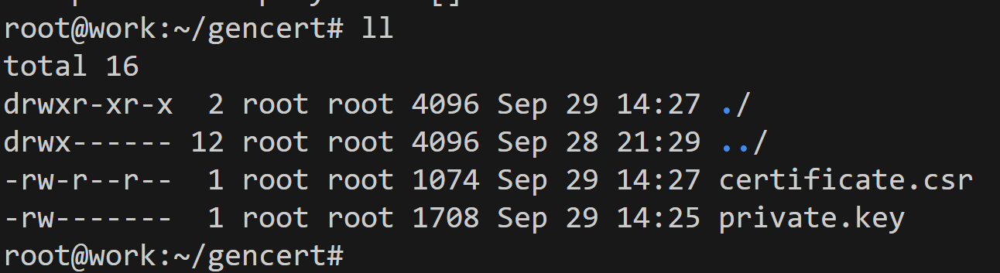

# Домашнее задание к занятию «Конфигурация приложений» - Илларионов Дмитрий

### Цель задания

В тестовой среде Kubernetes необходимо создать конфигурацию и продемонстрировать работу приложения.

------

### Чеклист готовности к домашнему заданию

1. Установленное K8s-решение (например, MicroK8s).
2. Установленный локальный kubectl.
3. Редактор YAML-файлов с подключённым GitHub-репозиторием.

------

### Инструменты и дополнительные материалы, которые пригодятся для выполнения задания

1. [Описание](https://kubernetes.io/docs/concepts/configuration/secret/) Secret.
2. [Описание](https://kubernetes.io/docs/concepts/configuration/configmap/) ConfigMap.
3. [Описание](https://github.com/wbitt/Network-MultiTool) Multitool.

------

### Задание 1. Создать Deployment приложения и решить возникшую проблему с помощью ConfigMap. Добавить веб-страницу

1. Создать Deployment приложения, состоящего из контейнеров nginx и multitool.

Создал по аналогии как уже раньше сохдавал:

```
apiVersion: apps/v1
kind: Deployment
metadata:
  name: dep-ngix-multi
  labels:
    app: nginx-multi
spec:
  replicas: 1
  selector:
    matchLabels:
      app: nginx-multi
  template:
    metadata:
      labels:
        app: nginx-multi
    spec:
      containers:
      - name: nginx
        image: nginx:1.14.2
        ports:
        - containerPort: 80
      - name: multitool
        image: wbitt/network-multitool
        env:
        - name: HTTP_PORT
          value: "1180"
        - name: HTTPS_PORT
          value: "11443"
        ports:
        - containerPort: 1180
          name: http-port
        - containerPort: 11443
          name: https-port
```


Проверил - зашел в мультитул контейнер и курлом проверил порт 80 что работает nginx:


- nginx работает.

2. Решить возникшую проблему с помощью ConfigMap.

у меня проблем не возникло, т.к. сразу укзал разные порты. 
Какую проблему нужно бы решить через configMab? Видимо указывать порты не хардкодно в коде деплоймента а в отдельнмо конфигмепе?

3. Продемонстрировать, что pod стартовал и оба конейнера работают.

Уже показал выше что под стартовал, и мултитул работает т.к. я вошел в  него (см. выше) и ngix работает, т.к. я курлом открыл дефолтную страницу.

4. Сделать простую веб-страницу и подключить её к Nginx с помощью ConfigMap. Подключить Service и показать вывод curl или в браузере.

Зашел в контейнер nginx и там нашел где лежит файл дефолтный с сайтом html:


Лежит тут:

/usr/share/nginx/html/index.html

Попробую сюда примапить свой сайт из конфигмепа.

Создаю конфиг мэп:

```
apiVersion: v1
kind: ConfigMap
metadata:
  name: my-config-map
data:
  index.html: |
    enemy.types=aliens,monsters
    player.maximum-lives=5    
    user-interface.properties: |
    <!DOCTYPE html>
    <html>
    <head>
    <title>It's my site - Dmitry ILL</title>
    <style>
        body {
            width: 35em;
            margin: 0 auto;
            font-family: Tahoma, Verdana, Arial, sans-serif;
        }
    </style>
    </head>
    <body>
    <h1>It's my site - Dmitry ILL</h1>
    <p>Hello!</p>
    </body>
    </html>
```

модифицирую деплоймент:

```
apiVersion: apps/v1
kind: Deployment
metadata:
  name: dep-ngix-multi
  labels:
    app: nginx-multi
spec:
  replicas: 1
  selector:
    matchLabels:
      app: nginx-multi
  template:
    metadata:
      labels:
        app: nginx-multi
    spec:
      containers:
      - name: nginx
        image: nginx:1.14.2
        ports:
        - containerPort: 80
        volumeMounts:
        - name: configmap-volume
          mountPath: /usr/share/nginx/html/
          readOnly: true
      - name: multitool
        image: wbitt/network-multitool
        env:
        - name: HTTP_PORT
          value: "1180"
        - name: HTTPS_PORT
          value: "11443"
        ports:
        - containerPort: 1180
          name: http-port
        - containerPort: 11443
          name: https-port
      volumes:
      - name: configmap-volume
        configMap:
          name: my-config-map
          # An array of keys from the ConfigMap to create as files
          items:
          - key: "index.html" 
            path: "index.html" 
```

Применяю:

Конфиг мэп:


Деплоймент:


Захожу в мултитул:


Смотрю сайт на порту 80:


- сайт мой, ок - сайт работает внутри контейнера через конфиг мэп.

Далее делаю сервис:

```
apiVersion: v1
kind: Service
metadata:
  name: svc-nginx-multi-conf-map
spec:
  selector:
    app: nginx-multi
  ports:
    - name: nginx
      protocol: TCP
      port: 9003
      targetPort: 80
```

Применяю:


Делаю проброс портов для проверки сервиса:


в другом окне проверяю:


Т.е. сайт работает через сервис.

5. Предоставить манифесты, а также скриншоты или вывод необходимых команд.

Предоставил выше.
------

### Задание 2. Создать приложение с вашей веб-страницей, доступной по HTTPS 

1. Создать Deployment приложения, состоящего из Nginx.

Это уже есть - было в задании 1, контейнер с мултитулом не помешает, а наоборот помогает диагностировать работу nginx.

2. Создать собственную веб-страницу и подключить её как ConfigMap к приложению.

Это тоже уже быол выполнено в задании 1.

3. Выпустить самоподписной сертификат SSL. Создать Secret для использования сертификата.

В файле hosts на рабочей и на ВМ с микро - прописал имя mysite.local ведущее на IP ВМ с кубернетисом(микро) на локальный IP. 
Проверил пинги идут.

Создаю ключ закрытый и сертификат для https:
Создал папку /root/gencert/ и в папку сгенерил ключ:

```
openssl genrsa -out private.key 2048
```
Появился закрытый ключ:


далее генерю сертификат:

```
openssl req -new -key /root/gencert/private.key -out /root/gencert/certificate.csr
```

Отвечаю на вопросы и описываю CN:


Проверяю, появился файл сертификата:



4. Создать Ingress и необходимый Service, подключить к нему SSL в вид. Продемонстировать доступ к приложению по HTTPS. 

Читаю содержимое файлов:


Кпипащу эти значения в файл с описанием секрета:

```
apiVersion: v1
kind: Secret
metadata:
  name: my-secret-tls
data:
  tls.crt: |
    MIIC4TCCAckCAQAwgZsxCzAJBgNVBAYTAlJVMRMwEQYDVQQIDApTb21lLVN0YXRl
    MQ8wDQYDVQQHDAZNb3Njb3cxITAfBgNVBAoMGEludGVybmV0IFdpZGdpdHMgUHR5
    IEx0ZDEPMA0GA1UECwwGRG1pSUxMMRUwEwYDVQQDDAxteXNpdGUubG9jYWwxGzAZ
    BgkqhkiG9w0BCQEWDHRlc3RAdGVzdC5ydTCCASIwDQYJKoZIhvcNAQEBBQADggEP
    ADCCAQoCggEBAN6TqWrXqL4N+v/4KOXi/8DoBJ7oXBGMavfOet23VmBdn3KkWZPJ
    GRL+QtBQx/VJLwWH84nSjBpwAYsmOCx4wGEc439hHLz7E9WHAayzBwzRH4jeia+a
    S88v4pLk42KMWIFTUTHiWC+UHor+pn+DN1FYettJunyqH0J7LKl0IdqxIXqnKAtX
    vJ44yevw0smxFH9e13H/vvP7kEieIDu59giddisLqsgo3HkobRDSjp5QePKIb89K
    829kgshswRhdlFIG0EpCWgHjVkJaGLwpqnGBqju1CZmWS4Q6VKwlRnSGIanUf0kV
    3Jp47s0KDNK30Hw0+oinNvT2O+f2ZzD/nFECAwEAAaAAMA0GCSqGSIb3DQEBCwUA
    A4IBAQBA+2WuDMlM7pqTh/KMD4HFdNU5L28i8b3okpXszsClp3lPwKcTGQs0Zyg8
    IGAAevT3WYZMV8yQeZze5UNHuzOT096JUC6YGGK7rXliWeGFEIBHseYRWwycsdTJ
    U4JG7nuc8X7DN1ZeufOr5RqGY0TvXeogzGggIHU3CE+dWeIhwKWJhkUzqvu//moS
    OPsEIdmcj3R/wu2hk0HBB49N6KZFAsI++oQT8dA4YhwOjW773n2o6ecSdxk3ZoV5
    tca+OWxKMx/QsiufOpl4vOvZ5eXL9bNDUlO9wFn714xJQ9wTnHmxBdBwIyKaT4aZ
    h61QlP3GdCltOEZOXR06FoI2Jjv2
  tls.key: |
    MIIEvwIBADANBgkqhkiG9w0BAQEFAASCBKkwggSlAgEAAoIBAQDek6lq16i+Dfr/
    +Cjl4v/A6ASe6FwRjGr3znrdt1ZgXZ9ypFmTyRkS/kLQUMf1SS8Fh/OJ0owacAGL
    JjgseMBhHON/YRy8+xPVhwGsswcM0R+I3omvmkvPL+KS5ONijFiBU1Ex4lgvlB6K
    /qZ/gzdRWHrbSbp8qh9CeyypdCHasSF6pygLV7yeOMnr8NLJsRR/Xtdx/77z+5BI
    niA7ufYInXYrC6rIKNx5KG0Q0o6eUHjyiG/PSvNvZILIbMEYXZRSBtBKQloB41ZC
    Whi8Kapxgao7tQmZlkuEOlSsJUZ0hiGp1H9JFdyaeO7NCgzSt9B8NPqIpzb09jvn
    9mcw/5xRAgMBAAECggEAA+a5QMQGE0tNcELaRc5o6zLTnnqRlfyV8tNt05sM6q19
    /rDZ6s+mQ0qIw0UgWdVJjdloVGOsg5BmvWHJ+Nfdj19YHOdQ/35rId227jptq1lp
    4M1G5697YYtNLl9ir8kWQTF6hZIH7ofY0caWT6kAae69hRvj3Z89LCvaiGiw1qW4
    paSemRp6/sVqmat7uycwMpoCJSR6dleXv9w9zGxy4HaDKM5yTzzPatYx1kcMEfsV
    +hOfpuPX/BbeDj++k4UsTmqmjoAKNO2tkVahUuLlsKiokgUI3EjXL3XLR3zHO76V
    Jc9asJKKiA8hafyrpRFOwFelb4Zt/A6LfYi4CBf+jQKBgQD6ioL+vcyHlsUnvtVh
    Ll/JClhrxTFg9c/OHdYgHFJYrF0Zo9Se957FMdZJT9Y5/1Bb8QfrRShTR1oVmxHT
    1G8n0fEfRvv0sTNLnmTc2zqqFU2/gnXesYyD2NJX3PHys55b486nlOKqerDrfROH
    Vf9QRFf//oyH9IxRLKFja6eEKwKBgQDjbSs1DHvO1yizy2nEwAL2LmWbA72tXsiQ
    +UbqGkF4i3lm1gDlzuOY9w0YOBzzERnIgauvb8qPnb4c9EjRmpVZ508x2s4Ft1r1
    XqsxaqRwPP0bQEJgxFH6CDcUn9CBEXYz57i/8Ck1LI886SzCCRmUcu1skppUy4Kg
    sYsbVw43cwKBgQDpi2Ju2jglEFs6IH7BtzvcqMMhutC7xIfwaAmpJx1vwUSL2Rcj
    FEoxIbLR5hUZPTEIc5dhLbdYYgPMbh/hKX5wTRiKgl3ti5z4WW9GHSoDUBaIdbEw
    ZKtKYDw7YR88kUkF+UYzGutr5TC0Y4RnvLdheEPbwsn3FfQS2xqaFckyvwKBgQCM
    LqJPVJ6L5DuGd39+cwxgSkD+x9OGpcHi+oQnkH+CmhX+uTJcdKX9h2pe31eYy5Wk
    7aixvqqQ0553omuwJySgAd/izwfmpho+3FeRYjZxqGYrAfToSJpvD9lDsS6IIAdH
    /zD1vkboK8sutFuOTqWhxyVpowPV+ItQGZ+w/nwY2QKBgQCPZzlXapUn+FVjjok0
    xtOgGd2R095M6eqKYvJFu1IhMMQNJLP4tgnbdsmoRytCybRxUG9Ru3GY6zRoT5Ec
    oNM/wViIVrZlKvi/CZRggEw342KmYfrKTLwQj962Jif6T7nnAzqwIPsJvErs78Ng
    XgSxY7p+Qy1NcjE2vhQslcvc1w==
type: kubernetes.io/tls
```
Применяю секрет:


Сервис с 9003 порту был создан уже ранее в п.1 - его и буду использовать.

Создаю объект ingress:

```
apiVersion: networking.k8s.io/v1
kind: Ingress
metadata:
  name: my-ingress-config-map
spec:
  rules:
  - host: mysite.local
    http:
      paths:
      - path: /
        pathType: Prefix
        backend:
          service:
            name: svc-nginx-multi-conf-map
            port:
              number: 9003
  tls:
    - hosts:
        - mysite.local
      secretName: my-secret-tls
```
Применяю:


Если просто курлом открыть (по умолчанию 80 порт http), то:


Нужно открывать сразу по https:

```
curl -k https://mysite.local
```


- сайт открылся по https.

Далее на своем ПК в Windows так же в hosts прописал имя сайта и уже внешний IP у ВМ в интернете (публичный IP):


И в браузере проверил работу сайта по https:


4. Предоставить манифесты, а также скриншоты или вывод необходимых команд.

------

### Правила приёма работы

1. Домашняя работа оформляется в своём GitHub-репозитории в файле README.md. Выполненное домашнее задание пришлите ссылкой на .md-файл в вашем репозитории.
2. Файл README.md должен содержать скриншоты вывода необходимых команд `kubectl`, а также скриншоты результатов.
3. Репозиторий должен содержать тексты манифестов или ссылки на них в файле README.md.

------
